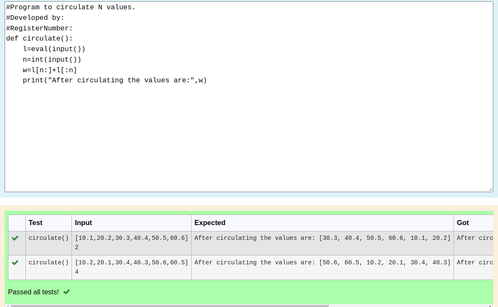

# Circulate-the-values-of-N-variables
## Aim:
To write a python program to circulate the n variables using function concept
## Equipment’s required:
PC
Anaconda - Python 3.7
## Algorithm: 
### Step 1: 
create a function of circulate
### Step 2: 
input the list from the user
### Step 3: 
Get the value from the user for the number of rotation
### Step 4: 
Using the slicing concept rotate the list

### Step 5: 
store rotated list
### Step 6: 
print the circulated values
## Program:
```
#Program to circulate N values.
#Developed by: adhithya perumal
#RegisterNumber: 22008747
def circulate():
    l=eval(input())
    n=int(input())
    w=l[n:]+l[:n]
    print("After circulating the values are:",w)
```

## Output:

## Result:
thus the experiment executed sucessfully